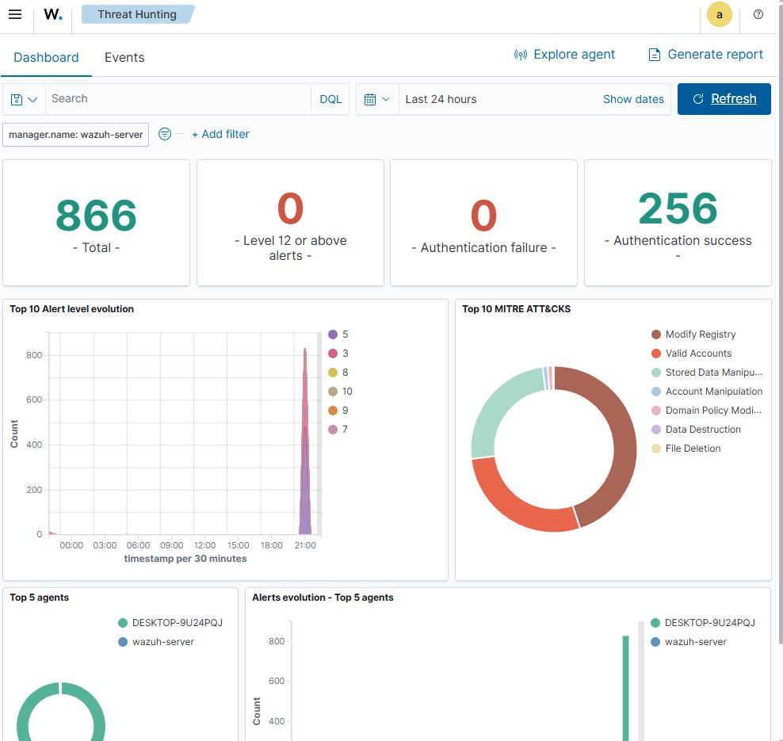

# Проект "Purple Team": Симуляция Атак (Nmap/Nikto) и Мониторинг (Wazuh SIEM)

## 📌 Описание проекта
Данный смежный проект представляет собой практическое исследование на стыке атаки (**Red Team**) и защиты (**Blue Team**). 
**Цель:** Проверить, как базовая конфигурация SIEM-системы Wazuh фиксирует внешние сетевые атаки и внутренние деструктивные действия в операционных системах Linux и Windows.

---

## 🛠️ Окружение и Архитектура Лаборатории
*   **Атакующая сторона:** Kali Linux (Инструменты: Nmap, Nikto).
*   **Защищаемая сторона №1:** Ubuntu Server 24.04 LTS (с установленным Wazuh-manager).
*   **Защищаемая сторона №2:** Хостовая Windows-машина (с установленным Wazuh Agent).
*   **Сетевой режим:** Все виртуальные машины переведены в режим **Сетевого моста (Bridged)** для обеспечения прямой видимости.

---

## 🕜 Ход работы (Хронология Атак)

### Этап 1: Сетевая разведка против Ubuntu Server
С Kali Linux было запущено агрессивное сканирование сервера Wazuh:
```bash
sudo nmap -A 192.168.3.49
```
*   **Результат Nmap:** Успешно определены открытые порты `22` (SSH) и `443` (Wazuh Dashboard), распознаны баннеры ОС.
*   **Реакция Wazuh:** Событие проигнорировано, критических алертов нет.

### Этап 2: Сканирование Windows-хоста (с агентом Wazuh)
Атака перенаправлена на основную Windows-машину для проверки работы агента:
```bash
sudo nmap -A 192.168.3.46
```
Затем была совершена попытка поиска веб-уязвимостей с помощью Nikto и специализированных скриптов:
```bash
nikto -h 192.168.3.46
sudo nmap --script vuln 192.168.3.46
```


*   **Результат Nmap/Nikto:** Брандмауэр Windows успешно заблокировал попытки веб-сканирования (порт 80 закрыт). Nmap определил служебные порты Windows, но не нашел явных эксплойтов.
*   **Реакция Wazuh:** Панель управления зафиксировала лишь фоновые изменения реестра модулем FIM (File Integrity Monitoring), но сетевые атаки остались незамеченными.

### Этап 3: Локальная атака "Внутренний нарушитель"
В терминале PowerShell от имени администратора на Windows были запущены команды симуляции локального брутфорса и полной очистки журналов безопасности:
```powershell
1..10 | ForEach-Object { net user Administrator НеверныйПароль123! }
wevtutil cl Security
```
*   **Реакция Wazuh:** Критические триггеры (Level 12+) не сработали.

---


## 🧠 Вывод

По итогам проекта был сделан фундаментальный вывод: **Любая SIEM-система "из коробки" — это пустая коробка.** 

Wazuh отработал штатно, но не забил тревогу по следующим причинам:
1.  **Отсутствие логов в ОС:** Обычное сканирование сети не генерирует ошибок внутри Windows/Ubuntu. Операционные системы считают это легитимным трафиком. Раз ОС не пишет лог — Wazuh Agent нечего отправлять на сервер.
2.  **Выключенный аудит Windows:** По умолчанию в Windows Home/Pro отключена расширенная политика аудита безопасности. Команда очистки логов (`wevtutil`) выполнилась, но сама Windows не зафиксировала этот факт в журнале.
3.  **Необходимость кастомизации:** Проект наглядно доказал, что для построения реальной защиты недостаточно просто установить агента.

### 🚀 Вектор дальнейшего развития (Next Steps):
Чтобы превратить эту "пустую коробку" в крепость, в будущем необходимо:
*   Интегрировать Wazuh с сетевыми системами обнаружения вторжений (**Suricata** или **Snort**), чтобы ловить Nmap на лету.
*   Включить расширенные политики аудита в Windows (GPO).
*   Установить утилиту **Sysmon** для детального отслеживания процессов.
